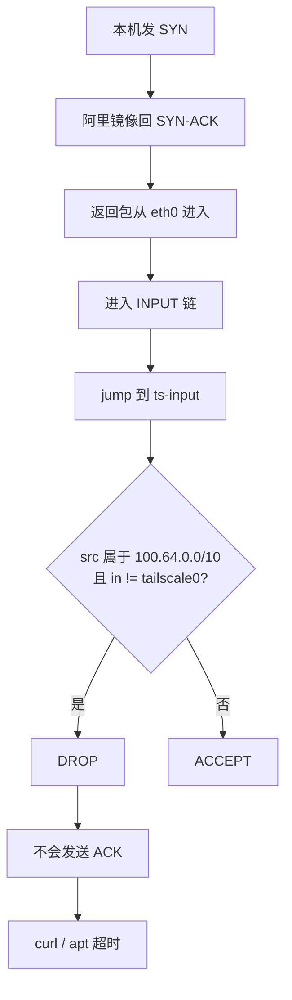

# 一次把 `apt update` 卡顿定位到 Tailscale `netfilter-mode=on` 误伤阿里云内网镜像的排障记录

## 背景

这台机器是阿里云内网 VPS，系统是 Ubuntu 24.04，宿主机上同时跑了 Docker 和 Tailscale。表面现象很简单：`apt update` 一直卡在阿里云镜像，`curl` 连 `mirrors.cloud.aliyuncs.com` 的 80 端口也超时。

最开始我怀疑的是常见问题：DNS、APT 源、IPv6、Docker 第三方源、Tailscale 抢路由。后来才发现，这次真正的问题不在“路由走哪”，而在“包回来以后是谁把它丢了”。

---

## 现象

最早的直接症状是：

```bash
xxx@iZbp1iz8ex9iwwpz8hzkptZ:~$ sudo apt update
0% [Connecting to mirrors.cloud.aliyuncs.com (100.100.2.148)]
0% [Connecting to mirrors.cloud.aliyuncs.com (100.100.2.148)]
0% [Connecting to mirrors.cloud.aliyuncs.com (100.100.2.148)]^C
```

这时我先做了两件事：看解析结果、看路由。

```bash
xxx@iZbp1iz8ex9iwwpz8hzkptZ:~$ sudo cat /etc/resolv.conf
nameserver 119.29.29.29

xxx@iZbp1iz8ex9iwwpz8hzkptZ:~$ ip route get 100.100.2.148
100.100.2.148 via 172.26.63.253 dev eth0 src 172.26.7.33 uid 1001
    cache
```

到这里，能先排掉两类问题：

1. 纯 DNS 故障已经不是主因了
2. 路由没有走 `tailscale0`，而是明确走 `eth0`

也正因为这一点，我当时**一度暂时把 Tailscale 排除了**。现在回头看，这是这次排障里最值得记住的误区：**“不是走 tailscale0” 只能排除路由劫持，不能排除 Tailscale 通过 netfilter 处理包。**

---

## 为什么会想到抓包看 ACK

接下来关键问题变成了：TCP 到底卡在哪一步。

TCP 三次握手里，客户端发 `SYN`，服务端回 `SYN-ACK`，客户端再回最终 `ACK` 才会进入 `ESTABLISHED`。如果最后这个 `ACK` 没有发出来，问题就不再是“远端在不在线”，而是“本机收到返回包以后为什么没有把连接建起来”。这个判断来自 TCP 的基本握手机制。([RFC 编辑器][1])

所以我直接抓 80 端口的 TCP 包：

```bash
xxx@iZbp1iz8ex9iwwpz8hzkptZ:~$ sudo tcpdump -i eth0 -nn host 100.100.2.148 and tcp port 80 
tcpdump: verbose output suppressed, use -v[v]... for full protocol decode
listening on eth0, link-type EN10MB (Ethernet), snapshot length 262144 bytes
10:00:09.364532 IP 100.100.2.148.80 > 172.26.7.33.46166: Flags [S.], seq 3205938873, ack 2638450993, win 64240, options [mss 1440,nop,nop,sackOK,nop,wscale 7], length 0
10:00:11.930532 IP 172.26.7.33.59900 > 100.100.2.148.80: Flags [S], seq 2034901454, win 64240, options [mss 1460,sackOK,TS val 92182152 ecr 0,nop,wscale 7], length 0
10:00:11.934414 IP 100.100.2.148.80 > 172.26.7.33.59900: Flags [S.], seq 1125267407, ack 2034901455, win 29200, options [mss 1440,nop,nop,sackOK,nop,wscale 7], length 0
10:00:12.975269 IP 172.26.7.33.59900 > 100.100.2.148.80: Flags [S], seq 2034901454, win 64240, options [mss 1460,sackOK,TS val 92183197 ecr 0,nop,wscale 7], length 0
...
```

这个抓包很关键。它说明：

* `SYN` 发出去了
* 对端也明确回了 `SYN-ACK`
* 但本机没有继续发最终 `ACK`
* 同一个 `SYN` 被不断重传

到这里，排查方向立刻从“网络不通”切成了“本机收到返回包后被谁丢了”。

---

## 第二轮：开始怀疑本机规则链，而不是 DNS

这时我继续排除基础项：

```bash
xxx@iZbp1iz8ex9iwwpz8hzkptZ:~$ sysctl net.ipv4.conf.all.rp_filter
net.ipv4.conf.all.rp_filter = 0

xxx@iZbp1iz8ex9iwwpz8hzkptZ:~$ sudo ufw status verbose
Status: inactive
```

`rp_filter` 不是，UFW 也不是。

接下来我没有继续猜，而是做了一个更干净的 A/B 测试：分别测试 Tailscale 的 `accept-dns` 和 `netfilter-mode`。

Tailscale 官方文档里，`on / nodivert / off` 的区别非常明确：
`on` 会创建规则并确保相关流量自动经过这些规则；`nodivert` 只创建 `ts-*` 子链，但不自动接入主链；`off` 则完全不管理防火墙。([Tailscale][2])

实际测试结果是：

* `accept-dns=true + netfilter=off`：正常
* `accept-dns=false + netfilter=on`：异常
* `accept-dns=true + netfilter=nodivert`：正常

这一步直接把 **MagicDNS** 排掉了。DNS 接管不是主因，真正的开关是 **`netfilter-mode=on`**。

---

## 最终定位：问题出在 `ts-input`

既然 `nodivert` 正常、`on` 异常，那就应该直接看两者的规则差异，而不是盯着整份规则发呆。

先看最明显的差异：

```bash
-A INPUT -j ts-input
-A FORWARD -j ts-forward
-A POSTROUTING -j ts-postrouting
```

也就是说，`on` 模式比 `nodivert` 多做了一件事：**把主链自动跳到 `ts-*` 链里。** 这和官方文档描述完全一致。([Tailscale][2])

继续看 `nft` diff，真正的关键点出来了：

```bash
chain ts-input {
    ip saddr 100.64.0.0/10 iifname != "tailscale0" counter packets 1 bytes 76 drop
}
```

而阿里云镜像地址是：

```bash
100.100.2.148
```

`100.100.2.148` 正好落在 `100.64.0.0/10` 里。Tailscale 官方也说明它默认使用的 IPv4 地址池正是 `100.64.0.0/10` CGNAT 段。([Tailscale][2])

所以整条路径终于闭环了：



---

## 最后的实锤

为了避免只是“看起来像”，我在 `netfilter-mode=on` 下，手工往 `ts-input` 最前面插了一条例外：

```bash
xxx@iZbp1iz8ex9iwwpz8hzkptZ:~$ sudo tailscale down
xxx@iZbp1iz8ex9iwwpz8hzkptZ:~$ sudo tailscale up --accept-dns=false --netfilter-mode=on
Some peers are advertising routes but --accept-routes is false
xxx@iZbp1iz8ex9iwwpz8hzkptZ:~$ curl -I --connect-timeout 5 http://mirrors.cloud.aliyuncs.com/ubuntu/

curl: (28) Failed to connect to mirrors.cloud.aliyuncs.com port 80 after 5002 ms: Timeout was reached
xxx@iZbp1iz8ex9iwwpz8hzkptZ:~$
xxx@iZbp1iz8ex9iwwpz8hzkptZ:~$ sudo iptables -I ts-input 1 -s 100.100.2.148/32 -i eth0 -j ACCEPT
xxx@iZbp1iz8ex9iwwpz8hzkptZ:~$ sudo iptables -I ts-input 1 -s 100.100.2.148/32 -i eth0 -j ACCEPT
xxx@iZbp1iz8ex9iwwpz8hzkptZ:~$ curl -I --connect-timeout 5 http://mirrors.cloud.aliyuncs.com/ubuntu/
HTTP/1.1 200 OK
Server: Tengine
Date: Mon, 23 Mar 2026 02:44:19 GMT
...
```

插完立刻恢复，这个根因就算彻底实锤了。

---

## 结论与处理

这次故障不是 MagicDNS，不是 Docker NAT，也不是阿里镜像本身坏了。

**根因是：Tailscale `netfilter-mode=on` 时，`ts-input` 里的 CGNAT 防伪造规则，把阿里云内网镜像 `100.100.2.148` 当成了不该从 `eth0` 进来的 `100.64.0.0/10` 流量，直接丢掉了。**

我最后采用的稳定方案是：

```bash
sudo tailscale down
sudo tailscale up --accept-dns=false --netfilter-mode=nodivert
```

`nodivert` 仍然保留 Tailscale 能力，但不会自动把宿主机主链跳到 `ts-*` 规则里，因此不会误伤阿里云这类 `100.x.x.x` 内网服务。([Tailscale][2])

---

## 这次排障最大的收获

1. `ip route get` 只能说明“路由没被抢”，不能说明“Tailscale 没介入”
2. 一旦看到 `SYN-ACK` 已经回来但本机不回 ACK，优先查本机 netfilter / conntrack
3. `nodivert` 和 `on` 的差异，比“有没有 ts-input 链”更重要
4. `100.64.0.0/10` 这种 CGNAT 地址段，遇到云厂商内网服务时一定要提高警惕

---

[1]: https://www.rfc-editor.org/rfc/rfc793.html?utm_source=chatgpt.com "RFC 793: Transmission Control Protocol"
[2]: https://tailscale.com/kb/1593/netfilter-modes?utm_source=chatgpt.com "Tailscale netfilter modes · Tailscale Docs"
